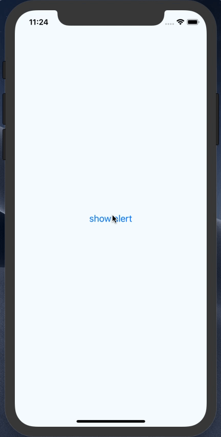

# react-native-snack
Simple snackbar component for React Native.

## Features

- TypeScript support!
- iOS(include iPhoneX) & Android support!
- No native modules. You can use without `react-native link` command.
- Customizable


## ScreenShots



## Usage
Install library.

```shell
$ npm i --save react-native-snack
```

or

```shell
$ yarn add react-native-snack
```

Import library.

```javascript
import {Snackbar} from 'react-native-snack';
```

Insert snackbar component to your view root.

```javascript
<View>
  {/* Your application component... */}
  <Snackbar />
</View>
```

And, call `Snackbar.show()`.

```javascript
Snackbar.show({message: 'Hello world!'});
```

## Options

|  | type | default value | description |
|-----------------|--------------------|---------------|--------------------------------|
| message | string(required) |  | display message |
| textColor | string(optional) | white | text color |
| backgroundColor | string(optional) | gray | snackbar color |
| duration | number(optional) | 2000 | display time(msec) |
| onCompletedShow | function(optional) | undefined | callback on display completion |
| onCompletedHide | function(optional) | undefined | callback on hide completion |
